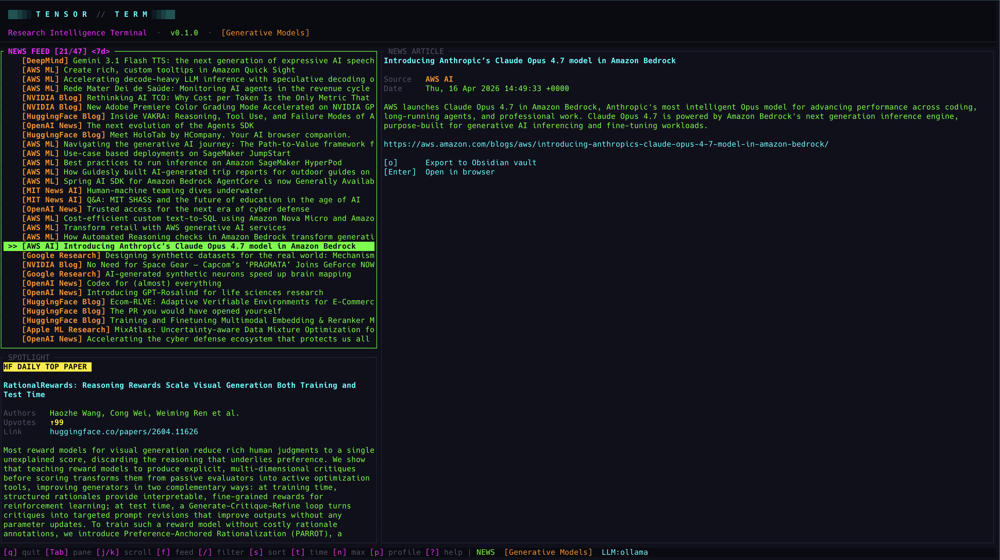

<p align="center">
  
  
  
  
  
</p>

<h1 align="center">
<pre>
██▓▒░ T E N S O R  //  T E R M ░▒▓██
</pre>
<sub>AI/ML Research Intelligence Terminal</sub>
</h1>

<p align="center">
A cyberpunk-themed terminal dashboard for staying up to date on ML/AI research papers, news, and social feeds from leading industry pioneers, plus turning papers into actionable knowledge... all without leaving your terminal.
</p>

<p align="center">
  
  
  
  
</p>

<p align="center">
  
</p>

---

## What is TensorTerm?

TensorTerm is a terminal-native research dashboard for ML/AI work. It pulls together the things you'd otherwise have open in a dozen browser tabs: ArXiv, HuggingFace, Semantic Scholar, AI lab blogs, and social posts by leading AI/ML pioneers of the industry.

Beyond reading, it turns papers into something you can act on: LLM generated summaries (5 modes), one-keypress implementation scaffolds, and structured Obsidian export with citations and metadata baked in.

### Key Highlights

- **Live ArXiv feed** with keyword highlighting, profile-based filtering, and time-windowed views
- **HuggingFace Daily Spotlight**: the highest-upvoted paper of the day, front and center
- **Semantic Scholar citations**: total, influential, and top citing papers
- **5 LLM summary modes**: from ELI5 to Research Gaps, powered by any LLM you configure
- **Implementation scaffolding**: generate a full project roadmap from any paper with one keypress
- **Obsidian export**: rich markdown notes with YAML frontmatter, citations, summaries, and scaffolds
- **Social feed**: track Karpathy, LeCun, Altman, and others via RSS/Atom and Nitter
- **News tab**: curated AI research blogs (DeepMind, OpenAI, Apple ML, HuggingFace, MIT, NVIDIA, …) with full-article HTML→Markdown rendering
- **Paper search**: search the HuggingFace papers index directly from the terminal
- **Paper vault**: bookmark papers into named collections, browse and manage them in a dedicated view
- **Zero-credit quickstart**: run with local Ollama models, no API keys needed

---

## Installation

### Homebrew (macOS/Linux)

```sh
brew tap RishabhSood/tap
brew install tensorterm
```

### Windows

Download `tensorterm-x86_64-pc-windows-msvc.zip` from the [latest release](https://github.com/RishabhSood/TensorTerm/releases), extract, and add to your `PATH`. Or install from source:

```sh
cargo install --git https://github.com/RishabhSood/TensorTerm.git
```

### From source

```sh
git clone https://github.com/RishabhSood/TensorTerm.git
cd TensorTerm
cargo install --path .
```

### Prerequisites

- **Rust 1.70+** (if building from source)
- A terminal with 256-color or truecolor support (iTerm2, Alacritty, Kitty, WezTerm, etc.)

---

## Quickstart (Free, No API Keys)

The fastest way to get started is with **Ollama** to run LLMs locally or via cloud, no credit card needed:

```sh
# 1. Install Ollama (https://ollama.com)
brew install ollama

# 2. Option A: Pull a local model
ollama pull llama3

# 2. Option B: Use a cloud model directly (requires `ollama login`)
ollama login

# 3. Start the Ollama server
ollama serve

# 4. Run TensorTerm
tensorterm
```

On first launch, a config file is created at `~/.config/tensor_term/config.toml`. Add the Ollama provider:

```sh
tensorterm --edit-config
```

Add this to your config:

```toml
# Cloud model (requires ollama login)
[[llm.openai_compatible]]
name = "ollama"
base_url = "http://localhost:11434/v1"
model = "gpt-oss:120b-cloud"

# Or use a local model instead
# [[llm.openai_compatible]]
# name = "ollama"
# base_url = "http://localhost:11434/v1"
# model = "llama3"
```

That's it. Paper feeds, spotlights, and social feeds work immediately with no keys at all. LLM features (summaries, scaffolds) use your Ollama instance.

---

## Data Sources

| Source | What it provides | API Key? |
|--------|-----------------|----------|
| **ArXiv** | Paper feed (titles, authors, abstracts, dates, domains) | No |
| **HuggingFace Papers** | Daily spotlight + paper metadata (upvotes, comments, AI summary, keywords, GitHub repos) | No |
| **HuggingFace Search** | On-demand paper search (`S` key) | No |
| **Semantic Scholar** | Citation count, influential citations, top citing papers | No (rate limited) |
| **Nitter / RSS** | Social posts from thought leaders (Twitter/X via Nitter, blogs via RSS/Atom) | No |
| **Curated AI blogs** | News tab: DeepMind, OpenAI, Apple ML, MIT, Google Research, HuggingFace, AWS AI/ML, NVIDIA, CMU ML | No |

All data fetching is async and non-blocking. Papers auto-load on startup, metadata is fetched on-demand with debouncing, and the UI stays responsive throughout.

---

## Layout

Three panes: **Feed** (top-left), **Spotlight** (bottom-left), **Article** (right). Navigate between them with `Tab` or `h`/`l`.

The Feed pane swaps content based on the active mode (`f` cycles Papers → Social → News, `v` toggles into Vault):

<p align="center">
  
</p>

<p align="center">
  
</p>

---

## Keybindings

### Navigation

| Key | Action |
|-----|--------|
| `j` / `k` / `↑` / `↓` | Scroll up / down |
| `h` / `l` / `←` / `→` | Switch pane |
| `Tab` / `Shift+Tab` | Next / previous pane |
| `g` | Jump to top of list |
| `G` | Jump to bottom of list |

### Feed Controls

| Key | Action |
|-----|--------|
| `f` | Cycle feed: Papers → Social → News |
| `v` | Toggle Vault (bookmarked papers): works from any feed |
| `/` | Start filter: type to live-search the current feed |
| `S` | Search HuggingFace papers (Papers mode only) |
| `Esc` | Clear filter / dismiss overlay / drill back in Vault |
| `s` | Cycle sort: Date → Citations → Title (papers only) |
| `t` | Cycle time window: 24h → 7d → 30d → All |
| `n` | Cycle max items: 10 → 25 → 50 → 75 → 100 |
| `p` | Cycle research profile |
| `r` | Refresh active feed |

### Paper Actions

| Key | Action |
|-----|--------|
| `Enter` | Open paper in browser / drill into vault collection |
| `b` | Bookmark paper to Reading List |
| `B` | Bookmark to a specific collection (picker modal) |
| `d` | Remove paper from collection / delete collection (vault mode) |
| `m` | Cycle summary mode: Off → TL;DR → ELI5 → Technical → Key Findings → Research Gaps |
| `M` | Generate LLM summary (for the active summary mode) |
| `L` | Cycle LLM provider (if multiple configured) |
| `i` | Generate implementation scaffold |
| `o` | Export paper to Obsidian vault |

### General

| Key | Action |
|-----|--------|
| `?` | Toggle help overlay |
| `q` | Quit |

---

## Research Profiles

Profiles define which ArXiv categories and keywords you care about. Switch between them with `p`.

```toml
[profiles.generative]
name = "Generative Models"
arxiv_categories = ["cs.CL", "cs.LG"]
high_weight_keywords = ["Generative Flows", "TimesFM", "LLaMA"]
feed_sources = ["arxiv"]

[profiles.rl_agents]
name = "RL Agents"
arxiv_categories = ["cs.AI"]
high_weight_keywords = ["DDPG", "PPO", "TD3", "Multi-Agent"]
feed_sources = ["arxiv"]
```

Add as many profiles as you want:

```toml
[profiles.diffusion]
name = "Diffusion & Image Gen"
arxiv_categories = ["cs.CV", "cs.LG"]
high_weight_keywords = ["Diffusion", "Stable Diffusion", "DALL-E", "Imagen", "ControlNet"]
feed_sources = ["arxiv"]

[profiles.robotics]
name = "Robotics & Embodied AI"
arxiv_categories = ["cs.RO", "cs.AI"]
high_weight_keywords = ["manipulation", "locomotion", "sim-to-real", "VLA"]
feed_sources = ["arxiv"]
```

Papers matching your `high_weight_keywords` are highlighted in the feed with a distinct color.

---

## Social Feed

Toggle to the social feed with `f`. Track AI thought leaders via RSS/Atom feeds and Twitter/X (via Nitter proxy).

### Default feeds

The config ships with feeds for Andrej Karpathy, Yann LeCun, Sam Altman, Dario Amodei, Ilya Sutskever, Dwarkesh Patel, and Elon Musk (filtered to AI topics).

### Adding feeds

```toml
# RSS/Atom blog
[[social.feeds]]
name = "Simon Willison"
source = "rss:https://simonwillison.net/atom/everything/"

# Twitter/X via Nitter
[[social.feeds]]
name = "Jim Fan"
source = "twitter:DrJimFan"

# Twitter/X with keyword filter (only show matching posts)
[[social.feeds]]
name = "Elon Musk"
source = "twitter:elonmusk"
keywords = ["AI", "xAI", "Grok", "compute", "neural", "AGI"]
```

### Nitter instance

Twitter feeds are fetched via a Nitter RSS proxy. Configure the instance:

```toml
[social]
nitter_instance = "https://nitter.net"
```

> **Note**: Nitter instances can be unreliable. If Twitter feeds aren't loading, try a different instance or switch to RSS sources.

---

## News Feed

The News tab pulls from curated AI research blogs and labs. Cycle to it with `f` (Papers → Social → News).

### Default sources

Pre-seeded on first run:

| Source | URL |
|--------|-----|
| DeepMind | `deepmind.google/blog/rss.xml` |
| OpenAI News | `openai.com/news/rss.xml` |
| Apple ML Research | `machinelearning.apple.com/rss.xml` |
| HuggingFace Blog | `huggingface.co/blog/feed.xml` |
| MIT News (AI) | `news.mit.edu/rss/topic/artificial-intelligence2` |
| Google Research | `research.google/blog/rss/` |
| AWS AI / AWS ML | two separate AWS feeds |
| NVIDIA Blog | filtered with AI/LLM/CUDA keywords (mixed-content blog) |
| CMU ML Blog | `blog.ml.cmu.edu/feed/` |

### How it renders

- **Inline article view**: RSS HTML (`<description>` or `<content:encoded>`) is converted to Markdown via `html2md` and rendered with the same renderer used for LLM summaries. Links, headings, lists, code, bold/italic all preserved.
- **Full article export** (`o` key): fetches the article URL, extracts `<article>` / `<main>` / `<body>` content, strips nav/header/footer/aside/script/style, converts to Markdown, and saves to `<vault>/tensor_term_kb/news/{date}_{source-slug}_{title-slug}.md` with YAML frontmatter (title, source, url, published, tags).

### Adding sources

```toml
[[news.feeds]]
name = "Your Source Name"
url = "https://example.com/feed.xml"

# Optional per-source keyword filter (only show matching items)
[[news.feeds]]
name = "Mixed-Content Blog"
url = "https://example.com/feed/"
keywords = ["AI", "LLM", "neural"]
```

> Anthropic and Meta AI don't expose RSS/Atom feeds, so they aren't included. PRs welcome if a stable source emerges.

---

## Paper Search

Press `S` in Papers mode to search the HuggingFace papers index. Type your query and press `Enter`, results appear in the feed pane with full article view support. Press `Esc` to return to the regular feed.

Search results support all the same actions as the regular feed: metadata viewing, LLM summaries, scaffolding, Obsidian export, and bookmarking.

---

## Paper Vault

The vault is a local bookmarking system for organizing papers into named collections. Press `v` from any feed to toggle into it; press `v` (or `Esc` from the collections level) to exit.

### Bookmarking papers

- **`b`**: quickly save the current paper to your **Reading List** (default collection)
- **`B`**: open a collection picker modal to choose a specific collection, or create a new one

Bookmark keys work in Papers mode, Search results, and Vault mode (to add a paper to additional collections).

### Browsing the vault

The vault has two levels:

1. **Collections level**: shows all your collections with paper counts. Press `Enter` to drill into one.
2. **Papers level**: shows papers in the selected collection with full article view. Press `Esc` to go back.

### Managing collections

- A **Reading List** collection is created by default and cannot be deleted
- Create new collections via the `B` picker modal — select **+ New Collection...** at the bottom
- Collection names are validated for uniqueness (case-insensitive) and cannot be blank
- Delete a collection with `d` at the collections level (with confirmation)
- Remove a paper from a collection with `d` at the papers level (with confirmation)

### Full feature parity

Papers in the vault support the same actions as the regular feed:
- LLM summaries (`m` / `M`), implementation scaffolding (`i`), Obsidian export (`o`)
- Metadata fetching (HuggingFace upvotes, keywords, Semantic Scholar citations)
- The article view shows which collections a paper belongs to (e.g. `Saved in Reading List, Computer Vision`)

### Persistence

The vault is stored at `~/.config/tensor_term/vault.json` and persists across sessions. Paper metadata (title, authors, date, domain) is cached at bookmark time so the vault loads instantly without network calls.

---

## Summary Modes

Cycle through modes with `m`, then press `M` to generate. The TL;DR mode uses HuggingFace's community summary (no LLM needed); all others call your configured LLM provider.

| Mode | What it does |
|------|-------------|
| **Off** | No summary displayed |
| **TL;DR** | HuggingFace community summary: free, no LLM required |
| **ELI5** | "Explain Like I'm 5": simple analogies, no jargon, ~200 words |
| **Technical** | Deep-dive for expert audience: methodology, architecture, training details, ~300 words |
| **Key Findings** | Bullet-point extraction: 5-8 key contributions with quantitative results |
| **Research Gaps** | Critical review: limitations, open questions, assumptions that may not hold, ~200 words |

> Summaries are cached per paper per mode (switching modes or papers doesn't re-fetch)

---

## Paper Implementation Scaffolding

Press `i` on any paper to generate a **paper implementation scaffold**, i.e. a full project roadmap for implementing the paper's approach generated by your LLM:

1. **Project directory tree**: complete file structure
2. **Per-file descriptions**: what each file should contain and implement
3. **requirements.txt**: likely dependencies
4. **README outline**: project documentation structure

The scaffold is saved locally and tracked in `~/.config/tensor_term/scaffold_index.json`. If you re-press `i` on a paper that already has a scaffold, you'll be prompted to regenerate or keep the existing one.

Scaffolds use PyTorch by default unless the paper specifies otherwise.

---

## Obsidian Export

Press `o` to export the current paper to your Obsidian vault as a structured markdown note.

### What gets exported

- **YAML frontmatter**: title, authors, date, domain, arxiv_id, URLs, citation counts, HF upvotes, repo link, AI-generated tags
- **Abstract**: full paper abstract
- **Full paper text**: if fetched from ArXiv HTML
- **AI Summary**: your LLM-generated summary (or HuggingFace TL;DR)
- **Keywords**: AI-extracted topic tags
- **Citation Metrics**: total, influential, top citing papers with their own citation counts
- **Implementation section**: GitHub repo link + stars
- **Scaffold**: your generated implementation roadmap (as a Python code block)
- **Notes section**: empty section for your own annotations

Notes are saved to `<vault>/tensor_term_kb/` with filenames like `2401.12345_paper-title-slug.md`. News articles are saved separately under `<vault>/tensor_term_kb/news/`. Duplicate detection prevents re-exporting the same item.

### Inspiration

Inspired by [Andrej Karpathy's approach to LLM knowledge bases](https://x.com/karpathy/status/2039805659525644595):

> *"Using LLMs to build personal knowledge bases for various topics of research interest... raw data from sources is collected, then compiled by an LLM into a .md wiki, then operated on by various CLIs to do Q&A and to incrementally enhance the wiki, and all of it viewable in Obsidian."* — Andrej Karpathy

TensorTerm automates the first mile: collect → enrich with metadata + LLM analysis → export structured Markdown ready for Obsidian. Your vault becomes a growing, searchable knowledge base you can build on with your own LLM tools.

---

## LLM Providers

TensorTerm supports multiple LLM backends through a unified provider system. Configure one or many and switch between them at runtime with `L`.

### Native providers

```toml
[llm]
active = "anthropic"

[llm.anthropic]
model = "claude-sonnet-4-20250514"
# api_key = "sk-ant-..."          # or set ANTHROPIC_API_KEY

[llm.openai]
model = "gpt-4o"
# api_key = "sk-..."              # or set OPENAI_API_KEY
```

### OpenAI-compatible endpoints

A single mechanism for Ollama, OpenRouter, vLLM, LM Studio, or any OpenAI-compatible API. Add as many as you want:

```toml
# Local Ollama
[[llm.openai_compatible]]
name = "ollama"
base_url = "http://localhost:11434/v1"
model = "llama3"

# OpenRouter
[[llm.openai_compatible]]
name = "openrouter"
base_url = "https://openrouter.ai/api/v1"
api_key = "sk-or-..."
model = "anthropic/claude-3.5-sonnet"
```

Set `[llm].active` to the `name` of the provider you want as default; cycle with `L` at runtime. API keys can be inlined or sourced from `ANTHROPIC_API_KEY` / `OPENAI_API_KEY`.

---

## Configuration Reference

The config lives at `~/.config/tensor_term/config.toml` (respects `XDG_CONFIG_HOME`).

```sh
# Print the config path
tensorterm --config-path

# Open in your $EDITOR
tensorterm --edit-config
```

### All settings

| Section | Key | Default | Description |
|---------|-----|---------|-------------|
| `general` | `default_profile` | `"generative"` | Profile loaded on startup |
| `general` | `tick_rate_ms` | `80` | UI refresh interval in milliseconds |
| `general` | `max_feed_items` | `50` | Max papers to fetch per refresh |
| `general` | `enable_semantic_scholar` | `false` | Enable citation fetching (S2 is rate-limited) |
| `general` | `implementations_dir` | `~/.tensor_term/implementations` | Where generated scaffolds are saved |
| `llm` | `active` | `"anthropic"` | Default LLM provider |
| `obsidian` | `vault_path` | `""` | Path to your Obsidian vault (supports `~`) |
| `social` | `nitter_instance` | `"https://nitter.net"` | Nitter proxy for Twitter feeds |
| `social.feeds` | `[[…]]` | 7 thought leaders | RSS/Twitter feeds for the social tab |
| `news.feeds` | `[[…]]` | 10 AI labs/blogs | RSS/Atom feeds for the news tab |

A fully commented default config is generated on first run; just open it and customize.

---

## CLI Flags

```
tensorterm [OPTIONS]

Options:
      --config-path    Print the config file path and exit
      --edit-config    Open the config file in $EDITOR and exit
  -h, --help           Print help
  -V, --version        Print version
```

---

## UI Cues

- Active pane has a pulsing cyan border so keyboard focus is always obvious
- A brief border flash on data arrival confirms async fetches landed
- Papers matching your active profile's keywords are highlighted in the feed
- ArXiv category badges color-code at a glance

---

## Architecture

```
src/
├── main.rs              CLI entry point (clap)
├── app.rs               State machine, actions, key dispatch
├── config.rs            TOML config with defaults
├── event.rs             Crossterm event loop (OS thread)
├── network.rs           Async background worker (tokio)
├── obsidian.rs          Markdown export to Obsidian vault (papers + news)
├── scaffold_index.rs    JSON index of generated scaffolds
├── vault.rs             Paper vault: bookmarks, collections, JSON persistence
├── logger.rs            Debug file logger
├── llm/
│   ├── mod.rs           Provider trait + registry + prompts
│   ├── anthropic.rs     Anthropic Claude provider
│   └── openai_compat.rs OpenAI-compatible provider (OpenAI, Ollama, OpenRouter, …)
├── providers/
│   ├── arxiv.rs         ArXiv Atom XML feed
│   ├── arxiv_html.rs    Full paper text from ArXiv HTML rendering
│   ├── huggingface.rs   HF daily papers + spotlight
│   ├── hf_papers.rs     HF paper metadata API
│   ├── hf_search.rs     HF paper search API
│   ├── news.rs          AI research blogs (RSS/Atom + html2md)
│   ├── semantic_scholar.rs  S2 Graph API (citations)
│   └── social.rs        RSS/Atom + Nitter social feed
└── ui/
    ├── mod.rs           Layout composition
    ├── theme.rs         Cyberpunk color palette
    ├── markdown.rs      Markdown-to-ratatui renderer
    └── widgets/
        ├── header.rs    Animated banner
        ├── feed.rs      Paper / social / vault / news list
        ├── highlight.rs HF spotlight pane
        ├── article.rs   Paper / post / vault / news detail
        ├── status_bar.rs Bottom status bar
        ├── help.rs      Scrollable keybinding overlay
        └── modal.rs     Confirmation, scaffold prompt, collection picker
```

Event handling uses a dual-channel architecture: crossterm key/mouse events on an OS thread via `std::sync::mpsc`, and async network results via `tokio::sync::mpsc`. Network events drain non-blocking on each 80 ms tick; each fetch is inner-spawned so a slow source can't block the others.

---

## Changelog

### v0.1.2

**New Features**
- **News tab**: `f` cycle now includes News, pulling RSS/Atom from 10 curated AI labs (DeepMind, OpenAI, Apple ML, MIT, Google Research, HuggingFace, AWS AI/ML, NVIDIA, CMU ML); 6 more sources available as commented-out entries in the default config
- **HTML→Markdown rendering**: RSS article bodies are converted via `html2md` and rendered through the existing markdown renderer (links, headings, lists, code, formatting all preserved)
- **Full-article Obsidian export for news**: press `o` on any news item to fetch the full page, extract the main content, and save as `<vault>/tensor_term_kb/news/{date}_{source}_{title}.md` with YAML frontmatter
- **Vault is now a destination, not a feed mode**: `f` cycles only Papers/Social/News; Vault has its own `v` keybinding and remembers which feed to return to
- **Confirmation modals for vault deletes**: removing a paper or deleting a collection now requires `[y]` confirmation; Reading List is permanently protected from deletion

**UX Polish**
- Help overlay scrolling is bounded: no more scrolling past the last keybinding
- `r` (refresh) is context-aware: Papers / Social / News refresh their respective feed; Vault is no-op (local data)

### v0.1.1

**New Features**
- **Paper Search**: press `S` to search the HuggingFace papers index directly from the feed
- **Paper Vault**: bookmark papers into named collections with `b` / `B`, browse in a dedicated vault view (`f` to cycle), full action parity (summaries, scaffolds, Obsidian export)
- **Collection management**: create, delete, and browse named collections; Reading List is the default and protected from deletion
- **Scrollable help**: the `?` help overlay now scrolls with `j` / `k` to accommodate new keybindings
- **Collections display**: article view shows which collections a paper belongs to

**Fixes**
- **Scaffold output directory**: now correctly reads `implementations_dir` from config instead of hardcoded default
- **Feed error handling**: ArXiv fetch failures show a clear error in the status bar instead of silently loading misleading mock data

---

## License

MIT

---

<p align="center">
<sub>Built with Rust, ratatui, and too much neon.</sub>
</p>
