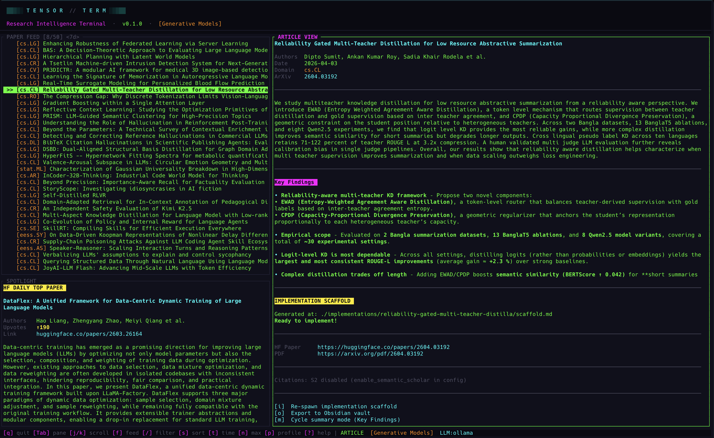
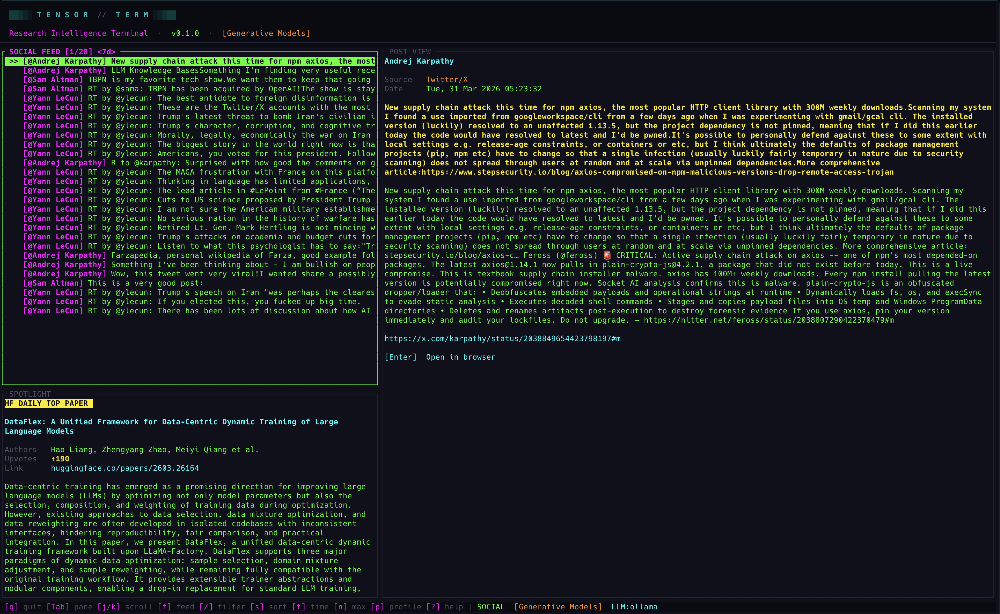

<p align="center">
  
  
  
  
</p>

<h1 align="center">
<pre>
██▓▒░ T E N S O R  //  T E R M ░▒▓██
</pre>
<sub>Research Intelligence Terminal</sub>
</h1>

<p align="center">
A cyberpunk-themed terminal dashboard for tracking ML research papers, thought leader social feeds, and turning papers into actionable knowledge — all without leaving your terminal.
</p>

<p align="center">
  
  
  
  
</p>

---

## What is TensorTerm?

TensorTerm is a terminal-native research dashboard that aggregates ML papers from ArXiv, surfaces the day's top paper from HuggingFace, pulls citation data from Semantic Scholar, and streams social posts from AI thought leaders — all rendered in a neon-glow cyberpunk TUI.

It goes beyond reading: you can generate LLM-powered summaries in multiple modes, scaffold full implementation plans from any paper, and export everything — metadata, summaries, citations, scaffolds — into your Obsidian vault as structured markdown knowledge base entries.

### Key Highlights

- **Live ArXiv feed** with keyword highlighting, profile-based filtering, and time-windowed views
- **HuggingFace Daily Spotlight** — the highest-upvoted paper of the day, front and center
- **Semantic Scholar citations** — total, influential, and top citing papers
- **5 LLM summary modes** — from ELI5 to Research Gaps, powered by any LLM you configure
- **Implementation scaffolding** — generate a full project roadmap from any paper with one keypress
- **Obsidian export** — rich markdown notes with YAML frontmatter, citations, summaries, and scaffolds
- **Social feed** — track Karpathy, LeCun, Altman, and others via RSS/Atom and Nitter
- **Zero-credit quickstart** — run with local Ollama models, no API keys needed

---

## Installation

### Homebrew (macOS/Linux)

```sh
brew tap yourusername/tap
brew install tensorterm
```

### From source

```sh
git clone https://github.com/yourusername/tensorterm.git
cd tensorterm
cargo install --path .
```

### Prerequisites

- **Rust 1.70+** (if building from source)
- A terminal with 256-color or truecolor support (iTerm2, Alacritty, Kitty, WezTerm, etc.)

---

## Quickstart (Free, No API Keys)

The fastest way to get started is with **Ollama** — run LLMs locally or via cloud, no credit card needed:

```sh
# 1. Install Ollama (https://ollama.com)
brew install ollama

# 2. Option A: Pull a local model
ollama pull llama3

# 2. Option B: Use a cloud model directly (requires `ollama login`)
ollama login

# 3. Start the Ollama server
ollama serve

# 4. Run TensorTerm
tensorterm
```

On first launch, a config file is created at `~/.config/tensor_term/config.toml`. Add the Ollama provider:

```sh
tensorterm --edit-config
```

Add this to your config:

```toml
# Cloud model (requires ollama login)
[[llm.openai_compatible]]
name = "ollama"
base_url = "http://localhost:11434/v1"
model = "gpt-oss:120b-cloud"

# Or use a local model instead
# [[llm.openai_compatible]]
# name = "ollama"
# base_url = "http://localhost:11434/v1"
# model = "llama3"
```

That's it. Paper feeds, spotlights, and social feeds work immediately with no keys at all. LLM features (summaries, scaffolds) use your Ollama instance.

---

## Data Sources

| Source | What it provides | API Key? |
|--------|-----------------|----------|
| **ArXiv** | Paper feed — titles, authors, abstracts, dates, domains | No |
| **HuggingFace Papers** | Daily spotlight (highest upvoted), upvotes, comments, AI summary (TL;DR), keywords, GitHub repos, project pages | No |
| **Semantic Scholar** | Citation count, influential citations, top citing papers | No (rate limited) |
| **Nitter / RSS** | Social posts from thought leaders (Twitter/X via Nitter proxy, blogs via RSS/Atom) | No |

All data fetching is async and non-blocking. Papers auto-load on startup, metadata is fetched on-demand with debouncing, and the UI stays responsive throughout.

---

## Layout



Three panes: **Feed** (top-left), **Spotlight** (bottom-left), **Article** (right). Navigate between them with `Tab` or `h`/`l`.

---

## Keybindings

### Navigation

| Key | Action |
|-----|--------|
| `j` / `k` / `↑` / `↓` | Scroll up / down |
| `h` / `l` / `←` / `→` | Switch pane |
| `Tab` / `Shift+Tab` | Next / previous pane |
| `g` | Jump to top of list |
| `G` | Jump to bottom of list |

### Feed Controls

| Key | Action |
|-----|--------|
| `f` | Toggle between Paper feed and Social feed |
| `/` | Start filter — type to live-search papers/posts |
| `Esc` | Clear filter / dismiss overlay |
| `s` | Cycle sort order: Date → Citations → Title (papers only) |
| `t` | Cycle time window: 24h → 7d → 30d → All |
| `n` | Cycle max items: 10 → 25 → 50 → 75 → 100 |
| `p` | Cycle research profile |
| `r` | Refresh feed |

### Paper Actions

| Key | Action |
|-----|--------|
| `Enter` | Open paper in browser (ArXiv page) |
| `m` | Cycle summary mode: Off → TL;DR → ELI5 → Technical → Key Findings → Research Gaps |
| `M` | Generate LLM summary (for the active summary mode) |
| `L` | Cycle LLM provider (if multiple configured) |
| `i` | Generate implementation scaffold |
| `o` | Export paper to Obsidian vault |

### General

| Key | Action |
|-----|--------|
| `?` | Toggle help overlay |
| `q` | Quit |

---

## Summary Modes

Cycle through modes with `m`, then press `M` to generate. The TL;DR mode uses HuggingFace's community summary (no LLM needed); all others call your configured LLM provider.

| Mode | What it does |
|------|-------------|
| **Off** | No summary displayed |
| **TL;DR** | HuggingFace community summary — free, no LLM required |
| **ELI5** | "Explain Like I'm 5" — simple analogies, no jargon, ~200 words |
| **Technical** | Deep-dive for expert audience — methodology, architecture, training details, ~300 words |
| **Key Findings** | Bullet-point extraction — 5-8 key contributions with quantitative results |
| **Research Gaps** | Critical review — limitations, open questions, assumptions that may not hold, ~200 words |

Summaries are cached per paper per mode — switching modes or papers doesn't re-fetch.

---

## Paper Implementation Scaffolding

Press `i` on any paper to generate a **paper implementation scaffold** — a full project roadmap for implementing the paper's approach, generated by your LLM:

1. **Project directory tree** — complete file structure
2. **Per-file descriptions** — what each file should contain and implement
3. **requirements.txt** — likely dependencies
4. **README outline** — project documentation structure

The scaffold is saved locally and tracked in `~/.config/tensor_term/scaffold_index.json`. If you re-press `i` on a paper that already has a scaffold, you'll be prompted to regenerate or keep the existing one.

Scaffolds use PyTorch by default unless the paper specifies otherwise.

---

## Obsidian Export

Press `o` to export the current paper to your Obsidian vault as a structured markdown note.

### What gets exported

- **YAML frontmatter** — title, authors, date, domain, arxiv_id, URLs, citation counts, HF upvotes, repo link, AI-generated tags
- **Abstract** — full paper abstract
- **Full paper text** — if fetched from ArXiv HTML
- **AI Summary** — your LLM-generated summary (or HuggingFace TL;DR)
- **Keywords** — AI-extracted topic tags
- **Citation Metrics** — total, influential, top citing papers with their own citation counts
- **Implementation section** — GitHub repo link + stars
- **Scaffold** — your generated implementation roadmap (as a Python code block)
- **Notes section** — empty section for your own annotations

Notes are saved to `<vault>/tensor_term_kb/` with filenames like `2401.12345_paper-title-slug.md`. Duplicate detection prevents re-exporting the same paper.

### Inspiration

This feature was directly inspired by [Andrej Karpathy's approach to LLM knowledge bases](https://x.com/karpathy/status/2039805659525644595):

> *"Using LLMs to build personal knowledge bases for various topics of research interest... raw data from sources is collected, then compiled by an LLM into a .md wiki, then operated on by various CLIs to do Q&A and to incrementally enhance the wiki, and all of it viewable in Obsidian."*
> — Andrej Karpathy

TensorTerm automates the first mile of this workflow: it collects papers, enriches them with metadata and LLM analysis, and exports structured markdown ready for Obsidian. Your vault becomes a growing, searchable research knowledge base — with citations, summaries, and implementation scaffolds — that you can query and build on with your own LLM tools.

---

## LLM Providers

TensorTerm supports multiple LLM backends through a unified provider system. Configure one or many — switch between them at runtime with `L`.

### Anthropic (Claude)

```toml
[llm]
active = "anthropic"

[llm.anthropic]
model = "claude-sonnet-4-20250514"
# api_key = "sk-ant-..."  # or set ANTHROPIC_API_KEY env var
```

### OpenAI

```toml
[llm.openai]
model = "gpt-4o"
# api_key = "sk-..."  # or set OPENAI_API_KEY env var
```

### Ollama (Local, Free)

```toml
[[llm.openai_compatible]]
name = "ollama"
base_url = "http://localhost:11434/v1"
model = "gpt-oss:120b-cloud"
```

### OpenRouter

```toml
[[llm.openai_compatible]]
name = "openrouter"
base_url = "https://openrouter.ai/api/v1"
api_key = "sk-or-..."
model = "anthropic/claude-3.5-sonnet"
```

### Any OpenAI-Compatible API

```toml
[[llm.openai_compatible]]
name = "my-provider"
base_url = "https://my-api.example.com/v1"
api_key = "..."
model = "model-name"
```

You can configure **multiple providers simultaneously** and cycle between them with `L` during runtime. API keys can be set in the config file or via environment variables (`ANTHROPIC_API_KEY`, `OPENAI_API_KEY`).

---

## Research Profiles

Profiles define which ArXiv categories and keywords you care about. Switch between them with `p`.

```toml
[profiles.generative]
name = "Generative Models"
arxiv_categories = ["cs.CL", "cs.LG"]
high_weight_keywords = ["Generative Flows", "TimesFM", "LLaMA"]
feed_sources = ["arxiv"]

[profiles.rl_agents]
name = "RL Agents"
arxiv_categories = ["cs.AI"]
high_weight_keywords = ["DDPG", "PPO", "TD3", "Multi-Agent"]
feed_sources = ["arxiv"]
```

Add as many profiles as you want:

```toml
[profiles.diffusion]
name = "Diffusion & Image Gen"
arxiv_categories = ["cs.CV", "cs.LG"]
high_weight_keywords = ["Diffusion", "Stable Diffusion", "DALL-E", "Imagen", "ControlNet"]
feed_sources = ["arxiv"]

[profiles.robotics]
name = "Robotics & Embodied AI"
arxiv_categories = ["cs.RO", "cs.AI"]
high_weight_keywords = ["manipulation", "locomotion", "sim-to-real", "VLA"]
feed_sources = ["arxiv"]
```

Papers matching your `high_weight_keywords` are highlighted in the feed with a distinct color.

---

## Social Feed

Toggle to the social feed with `f`. Track AI thought leaders via RSS/Atom feeds and Twitter/X (via Nitter proxy).

### Default feeds

The config ships with feeds for Andrej Karpathy, Yann LeCun, Sam Altman, Dario Amodei, Ilya Sutskever, Dwarkesh Patel, and Elon Musk (filtered to AI topics).

### Adding feeds

```toml
# RSS/Atom blog
[[social.feeds]]
name = "Simon Willison"
source = "rss:https://simonwillison.net/atom/everything/"

# Twitter/X via Nitter
[[social.feeds]]
name = "Jim Fan"
source = "twitter:DrJimFan"

# Twitter/X with keyword filter (only show matching posts)
[[social.feeds]]
name = "Elon Musk"
source = "twitter:elonmusk"
keywords = ["AI", "xAI", "Grok", "compute", "neural", "AGI"]
```

### Nitter instance

Twitter feeds are fetched via a Nitter RSS proxy. Configure the instance:

```toml
[social]
nitter_instance = "https://nitter.net"
```

> **Note**: Nitter instances can be unreliable. If Twitter feeds aren't loading, try a different instance or switch to RSS sources.

---

## Configuration Reference

The config lives at `~/.config/tensor_term/config.toml` (respects `XDG_CONFIG_HOME`).

```sh
# Print the config path
tensorterm --config-path

# Open in your $EDITOR
tensorterm --edit-config
```

### All settings

| Section | Key | Default | Description |
|---------|-----|---------|-------------|
| `general` | `default_profile` | `"generative"` | Profile loaded on startup |
| `general` | `tick_rate_ms` | `80` | UI refresh interval in milliseconds |
| `general` | `max_feed_items` | `50` | Max papers to fetch per refresh |
| `general` | `enable_semantic_scholar` | `false` | Enable citation fetching (S2 is rate-limited) |
| `llm` | `active` | `"anthropic"` | Default LLM provider |
| `obsidian` | `vault_path` | `""` | Path to your Obsidian vault (supports `~`) |
| `social` | `nitter_instance` | `"https://nitter.net"` | Nitter proxy for Twitter feeds |

A fully commented default config is generated on first run — just open it and customize.

---

## CLI Flags

```
tensorterm [OPTIONS]

Options:
      --config-path    Print the config file path and exit
      --edit-config    Open the config file in $EDITOR and exit
  -h, --help           Print help
  -V, --version        Print version
```

---

## Visual Features

- **Cyberpunk neon theme** — neon green, cyan, magenta, and yellow on a dark background
- **Pulsing active pane border** — sine-wave glow animation on the focused pane
- **Cyan flash on data arrival** — brief border pulse when new data loads
- **Braille spinner** — animated loading indicator during network fetches
- **Keyword highlighting** — papers matching your profile keywords glow in a distinct color
- **Domain tags** — color-coded ArXiv category badges
- **Animated header** — breathing glow effect on the TensorTerm banner

---

## Architecture

```
src/
├── main.rs              CLI entry point (clap)
├── app.rs               State machine, actions, key dispatch
├── config.rs            TOML config with defaults
├── event.rs             Crossterm event loop (OS thread)
├── network.rs           Async background worker (tokio)
├── obsidian.rs          Markdown export to Obsidian vault
├── scaffold_index.rs    JSON index of generated scaffolds
├── logger.rs            Debug file logger
├── llm/
│   ├── mod.rs           Provider trait + registry + prompts
│   ├── anthropic.rs     Anthropic Claude provider
│   └── openai_compat.rs OpenAI-compatible provider (OpenAI, Ollama, OpenRouter, etc.)
├── providers/
│   ├── arxiv.rs         ArXiv Atom XML feed
│   ├── huggingface.rs   HF daily papers + spotlight
│   ├── hf_papers.rs     HF paper metadata API
│   ├── semantic_scholar.rs  S2 Graph API (citations)
│   └── social.rs        RSS/Atom + Nitter social feed
└── ui/
    ├── mod.rs           Layout composition
    ├── theme.rs         Cyberpunk color palette
    ├── markdown.rs      Markdown-to-ratatui renderer
    └── widgets/
        ├── header.rs    Animated banner
        ├── feed.rs      Paper/social feed list
        ├── highlight.rs HF spotlight pane
        ├── article.rs   Paper detail + metadata
        ├── status_bar.rs Bottom status bar
        ├── help.rs      Keybinding overlay
        └── modal.rs     Confirmation dialogs
```

Event handling uses a dual-channel architecture: crossterm key/mouse events on an OS thread via `std::sync::mpsc`, and async network results via `tokio::sync::mpsc`. Network events are drained non-blocking on each 80ms tick.

---

## License

MIT

---

<p align="center">
<sub>Built with Rust, ratatui, and too much neon.</sub>
</p>
